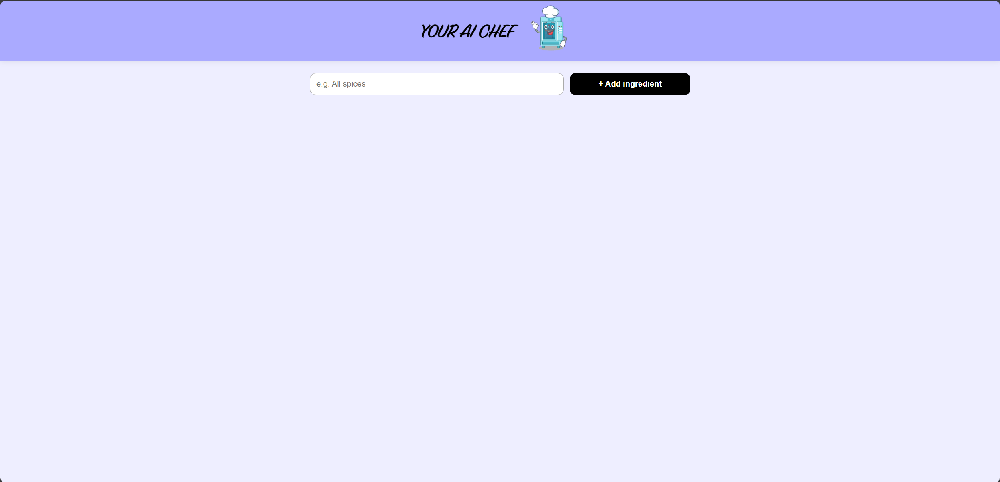
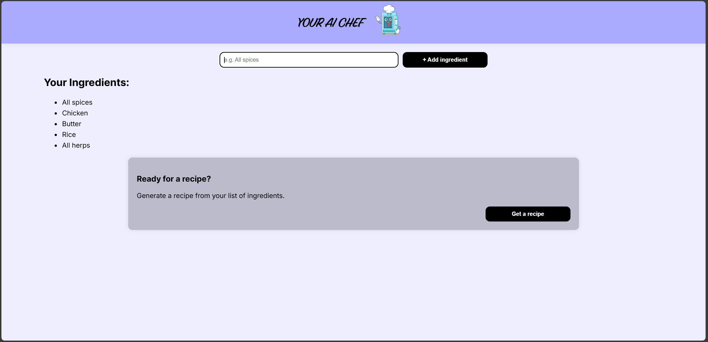
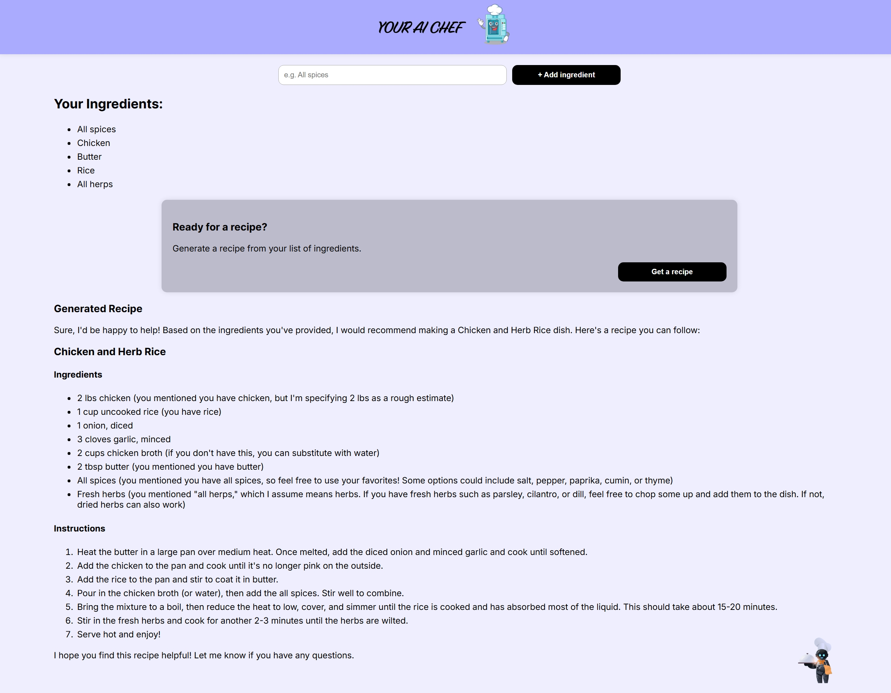

# 👨‍🍳 YOUR AI CHEF

**YOUR AI CHEF** is a smart cooking assistant built with **React** and powered by **Hugging Face's Mistral AI API**. It acts as your personal AI chef — helping you create recipes, meal plans, and ingredient substitutions using natural language input.

---

## 🚀 Features

- 🧠 AI-powered recipe generation
- 🥗 Custom meal planning based on dietary preferences
- 🔄 Smart ingredient substitutions
- 💬 Natural language interface
- ⚛️ Built with React for a seamless user experience

---

## 🔧 Tech Stack

- **Frontend**: React + JavaScript + CSS
- **AI Model**: Mistral via Hugging Face API

---

## 🛠️ Installation

1. **Clone the repo**
   ```bash
   git clone https://github.com/abdoalmowafy/YOUR-AI-CHEF-React-Hugging-Face-Mistral-AI
   cd your-ai-chef
   ```

2. **Install dependencies**
```bash
npm install
```

3. **Configure environment variables Create a .env file in the root directory and add your Hugging Face API key**
   ```bash
   VITE_HF_ACCESS_TOKEN=your_huggingface_api_key
   ```

4. **Run the development server**
```bash
   npm run dev
```

---

## ✨ Usage

Type in your cooking-related question or request in 5 cooking ingredients, such as:

- *"All Spices"*
- *"Chicken"*
- *"Butter"*
- *"Rice"*
- *"All herps"*

Click generate recipees and let **YOUR AI CHEF** do the rest!

---

## 📸 Screenshots





---

## 🤖 Powered By

- [React](https://reactjs.org/)
- [Mistral AI on Hugging Face](https://huggingface.co/mistralai/Mixtral-8x7B-Instruct-v0.1)

---


## 💡 Future Plans

- Voice command integration
- Save and share recipes
- User profiles with dietary preferences

---
